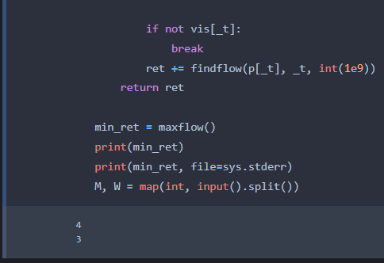

# UVA - 11506   Angry Programmer

You, a programmer of an important software house, have been fired because you didn’t solve an important problem that was assigned to you. You are very furious and want to take revenge on your boss, breaking the communication between his computer and the central server. The computer of your boss and the central server are in the same network, which is composed of many machines (computers) and wires linking pairs of those machines. There is at most one wire between any pair of machines and there can be pairs of machines without a wire between them. To accomplish your objective, you can destroy machines and wires, but you can’t destroy neither the computer of your boss nor the central server, because those machines are monitored by security cameras. You have estimated the cost of blowing up each machine and the cost of cutting each wire in the network. You want to determine the minimum cost of interrupting the communication between your boss’ computer and the central server. Two computers A and B can communicate if there is a sequence of undestroyed machines x1, . . . , xn such that x1 = A, xn = B and xi is linked with xi+1 with an uncut wire (for each 1 ≤ i ≤ n − 1).

## Input

The input consists of several test cases. Each test case is represented as follows:
• A line with two integers M and W (2 ≤ M ≤ 50, 0 ≤ W ≤ 1000), representing (respectively) the
number of machines and the number of wires in the network.
• M - 2 lines, one per machine (different from the boss’ machine and the central server), containing
the following information separated by spaces:

- An integer i (2 ≤ i ≤ M − 1) with the identifier of the machine. Assume that the boss’
  machine has id 1 and that the central server has id M.

- An integer c (0 ≤ c ≤ 100000) specifying the cost of destroying the machine.

• W lines, one per wire, containing the following information separated by spaces:

- Two integers j and k (1 ≤ j < k ≤ M) specifying the identifiers of the machines linked by
  the wire. Remember that the wire is bidirectional.
- An integer d (0 ≤ d ≤ 100000) specifying the cost of cutting the wire.
  The end of the input is specified by a line with the string ‘0 0’.
  Suppose that the machines have distinct identifiers.

## Output

For each test case, print a line with the minimum cost of interrupting the communication between the computer of your boss and the central server.

## Sample Input

```
4 4
3 5
2 2
1 2 3
1 3 3
2 4 1
3 4 3
4 4
3 2
2 2
1 2 3
1 3 3
2 4 1
3 4 3
0 0
```

## Sample Output

```
4
3
```

---

## 題目說明

給 M 個 node 與 W 條 edge 及他們的 capacity
求此圖的最小割

INPUT:
第一行輸入兩個整數 M 與 W ，代表有 M 個 node 與 W 條 edge
接下來有 M - 2 行，每行輸入兩個整數 U 、 C ，代表 node U 的 capacity 為 C
接下來有 W 行，每行輸入三個整數 U 、 V 、 C ，代表 edge U V 的 capacity 為 C

OUTPUT:
輸出此圖的最小割

## 解題方法
> 此題的解題概念為 `Maximum flow` 、 `Ford Fulkerson`

最小割可以轉換成最大流
點上的 `capacity` 可視為兩個相連的點， `edge` 的 `capacity` 為點上的 `capacity`
建完圖後跑 `Edmonds-Karp` 演算法即可。

## 參考程式碼

```c++
#include <iostream>
#include <memory.h>
#include <climits>
#include <queue>

using namespace std;

int M, W, U, V, C;
int _s = 1, _t;
int G[150][150];
int p[150];
bool vis[150];

void fast_io()  //輸入和輸出
{
	ios::sync_with_stdio(false);
	cout.tie(nullptr);
	cin.tie(nullptr);
}

void init()  //矩陣的初始化
{
	memset(G, 0, sizeof(G));
	memset(p, 0, sizeof(p));
}

void read_build()
{
	int node = M - 2;
	int _u, _v;
	_t = M + node;  //假設M = 4, _t = 6。有意思的是作者將電腦當作一條路徑，這樣能一起判斷電腦和纜線。

	for (int i = 0; i < node; ++i)
	{
		cin >> U >> C;  //輸入節點電腦和電腦的Ret。
		G[U][U + node] = G[U + node][U] = C;
	}
    
	while (W--)
	{
		cin >> U >> V >> C;  //輸入經過的途徑和途徑的Ret

		if (U == M) U = _t;
		if (V == M) V = _t;
		_u = (U != 1 && U != _t ? U + node : U);
		_v = (V != 1 && V != _t ? V + node : V);

		G[_u][V] = G[_v][U] = C;
	}
}

/*
是一個用於求解最大流的輔助函數，它的目的是找出augmenting path。
findflow() 函數的基本流程是：
1.如果已經到達了匯點，就返回當前的流量 c。
2.否則，尋找與 u 相鄰的點 v，如果 v 未被訪問過且 u 到 v 的流量大於 0，就遞歸調用 findflow() 函數求出
*/
int findflow(int u, int v, int c)
{
	if (v == _s) return c;
	c = findflow(p[u], u, min(G[u][v], c));  //用遞迴尋找BOSS(1)，並回傳路線中最小的Ret
	G[u][v] -= c;
	G[v][u] += c;
	return c;
}

/*
在 maxflow() 函數中，首先使用廣度優先搜索 (BFS) 算法尋找增廣路。然後，使用 findflow() 函數計算增廣路中可以增加的流量。最後，將增加的流量累加到最大流中。
*/
int maxflow()
{
	int ret = 0;

	while (1)
	{
		memset(vis, false, sizeof(vis));

		queue<int> Q;
		Q.emplace(_s);
		vis[_s] = true;

		while (!Q.empty() && !vis[_t])
		{
			int u = Q.front();
			Q.pop();

			for (int i = _s; i <= _t; ++i) if (!vis[i] && G[u][i] > 0)
			{
				Q.emplace(i);
				vis[i] = true;
				p[i] = u;
			}
		}

		if (!vis[_t]) break;
		ret += findflow(p[_t], _t, INT_MAX);
	}

	return ret;
}

int main()
{
	fast_io();

	while (cin >> M >> W, !(!M && !W))
	{
		init();
		read_build();
		cout << maxflow() << "\n";
	}
}
```

---

## Chat 建議

The code uses the maximum flow algorithm to solve the problem. Specifically, it uses the Edmonds-Karp algorithm, which is an implementation of the Ford-Fulkerson method for finding the maximum flow in a graph.

The maximum flow problem involves finding the maximum flow that can be sent through a graph from a source node to a sink node, while respecting the capacities of the edges in the graph. In this problem, the boss's computer is the source node, and the central server is the sink node. The goal is to find the minimum cost of interrupting the communication between the two by destroying machines and cutting wires in the network.

To solve the problem using the maximum flow algorithm, the code first builds a graph representation of the network. It then runs the Edmonds-Karp algorithm to find the maximum flow from the source node (the boss's computer) to the sink node (the central server). The minimum cost of interrupting the communication between the two is equal to the maximum flow.

The Edmonds-Karp algorithm works by repeatedly finding the shortest path from the source to the sink and adding the maximum flow possible along the path. It uses a breadth-first search to find the shortest path and a residual graph to keep track of the available capacity on each edge. The process is repeated until no more flow can be added. The maximum flow is then returned as the result.


## Code：

看懂後參考ChatGPT 將其改為Python  Code。

```python
import sys
sys.stdin = open("input.txt", "r")
sys.stdout = open("output.txt", "w")
input = sys.stdin.readline

M, W = map(int, input().split())

while M or W:
    _s = 1
    G = [[0] * 150 for _ in range(150)]
    p = [0] * 150
    vis = [False] * 150

    node = M - 2
    _t = M + node

    for i in range(node):
        U, C = map(int, input().split())
        G[U][U + node] = G[U + node][U] = C

    for _ in range(W):
        U, V, C = map(int, input().split())

        if U == M:
            U = _t
        if V == M:
            V = _t
        _u = (U != 1 and U != _t) and U + node or U
        _v = (V != 1 and V != _t) and V + node or V

        G[_u][V] = G[_v][U] = C

    def findflow(u, v, c):
        if v == _s:
            return c
        c = findflow(p[u], u, min(G[u][v], c))
        G[u][v] -= c
        G[v][u] += c
        
        return c

    def maxflow():
        ret = 0
        while True:
            vis = [False] * 150
            Q = []
            Q.append(_s)
            vis[_s] = True

            while Q and not vis[_t]:
                u = Q.pop(0)

                for i in range(_s, _t + 1):
                    if not vis[i] and G[u][i] > 0:
                        Q.append(i)
                        vis[i] = True
                        p[i] = u

            if not vis[_t]:
                break
            ret += findflow(p[_t], _t, int(1e9))
        return ret
    
    min_ret = maxflow()
    print(min_ret)
    print(min_ret, file=sys.stderr)
    M, W = map(int, input().split())
'''
輸出：
4
3
'''
```



---

作者： PingHe @
文章連結： https://www.pinghenotes.com/UVa-11506-Angry-Programmer/
版權聲明： 本網誌所有文章除特別聲明外，均採用 (CC)BY-NC-SA 許可協議。轉載請註明出處！