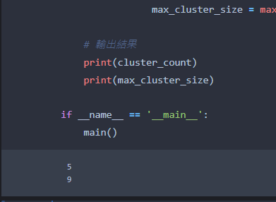

# a597. 祖靈被榨乾了!!!!!!!!

## 內容

段考結束了!!!!!!!

祖靈藉著他的外掛技能 "祖靈的祝福" 在段考上電爆全場，勇奪全校第一!!!!

祖靈他對此感到非常的高興.....

於是他回去他的房間延續他的好心情!!

於是祖靈在房間拼命的JIZZ，抱著超好的心情:)

但是繼之前祖靈已經榨出太多碗JIZZ麵了，他的身體已經不堪負荷了!!!!!

於是祖靈倒下了.........

-------------------警察來到了案發現場--------------------

A警：「這個人太猛了吧!!!整個房間快要遍全白了!!!!」

B警默默點頭表示認同......

A警：「他的身體也太猛了吧!!一定要請科學家來看看!!!」

於是科學家來了!!但是由於祖靈他房間實在太大而且有太多JIZZ了!!!! 無法當場調查....

於是請你幫幫科學家

給你他房間平面圖的長與寬，和平面圖，

幫他計算祖靈他房間有幾攤JIZZ，和最大那攤JIZZ的面積是多少。

 一攤JIZZ就是每一個J都在互相的上下左右，例：

```
XXJX
XJJJ
XXJX 
```

```
 J
JJJ
 J
```

即為一攤JIZZ。然而：y

```
XJ
JX
```

則是兩攤JIZZ。 

---

## 輸入說明

總共有500筆測資。
每筆測資開頭為 m,n ，分別代表祖靈房間平面圖的長與寬。 ( 0<m, n<=500 ， m行長度為n，對不起忘記說:P )
再來是一個圖  ( 請見範例輸入 ) 
其中 'X' 代表那個單位沒有祖靈的JIZZ ， 'J'代表那個單位有祖靈的JIZZ。 

---

## 輸出說明

輸出總共有幾攤祖靈的JIZZ，和最大的那攤JIZZ覆蓋了多少單位。 

---

## 範例輸入

```
5 5
XXXXX
XXJJX
XJJJX
XXXXX
XJXXX
```

## 範例輸出

```
2 5
```

---

## ChatGPT 建議：

這是一道關於二維平面圖的題目。給定的平面圖中有若干個字符 'J'，要求找出這些 'J' 字符形成的最大的連通塊，並輸出這個連通塊有多少個字符 'J'。

一種方法是使用深度優先搜索或廣度優先搜索來搜索整張圖。遇到字符 'J' 時，就從這個字符開始搜索，將所有能到達的 'J' 字符都標記為已訪問。最後，遍歷整張圖，統計已訪問的 'J' 字符的數量即可。


## 參考  [圖論：圖的儲存 & BFS & DFS](https://youtu.be/aH6vyJW7hEo)

BFS (Breadth-First Search) 和 DFS (Depth-First Search) 是兩種搜尋演算法，它們都是用來尋找圖形中的路徑或某些條件的演算法。

1. BFS 是從起點開始，沿著寬度優先搜尋每一層的演算法。它使用一個佇列 (queue) 來儲存已經走過但尚未拓展的節點。
2. DFS 是從起點開始，沿著深度優先搜尋每一層的演算法。它使用一個棧 (stack) 來儲存已經走過但尚未拓展的節點。


## Code

```python
import sys
sys.stdin = open("input2.txt", "r")
input = sys.stdin.readline


def dfs(i, j, graph, visited):
    # 將當前位置標記為已訪問
    visited[i][j] = True
    # 將當前位置的值加 1，表示找到了一個 'J' 字符
    count = 1

    # 搜索上下左右四個方向
    for dx, dy in [(1, 0), (-1, 0), (0, 1), (0, -1)]:
        x, y = i + dx, j + dy
        # 判斷是否越界或者已經訪問過
        if x < 0 or x >= len(graph) or y < 0 or y >= len(graph[0]) or visited[x][y]:
            continue
        # 如果當前位置是 'J' 字符，就繼續搜索
        if graph[x][y] == 'J':
            count += dfs(x, y, graph, visited)

    return count

def main():
    m, n = map(int, input().split())
    graph = []
    for _ in range(m):
        graph.append(input())

    # 初始化
    visited = [[False] * n for _ in range(m)]
    cluster_count = 0
    max_cluster_size = 0
    for i in range(m):
        for j in range(n):
            # 如果當前位置是 'J' 字符，就開始搜索
            if graph[i][j] == 'J' and not visited[i][j]:
                cluster_size = dfs(i, j, graph, visited)
                cluster_count += 1
                max_cluster_size = max(max_cluster_size, cluster_size)

    # 輸出結果
    print(cluster_count, file=sys.stderr)
    print(max_cluster_size, file=sys.stderr)

if __name__ == '__main__':
    main()
```



---

[下一題：i793. pC. WAKUWAKU 尋找興奮源 (⌓‿⌓)]()